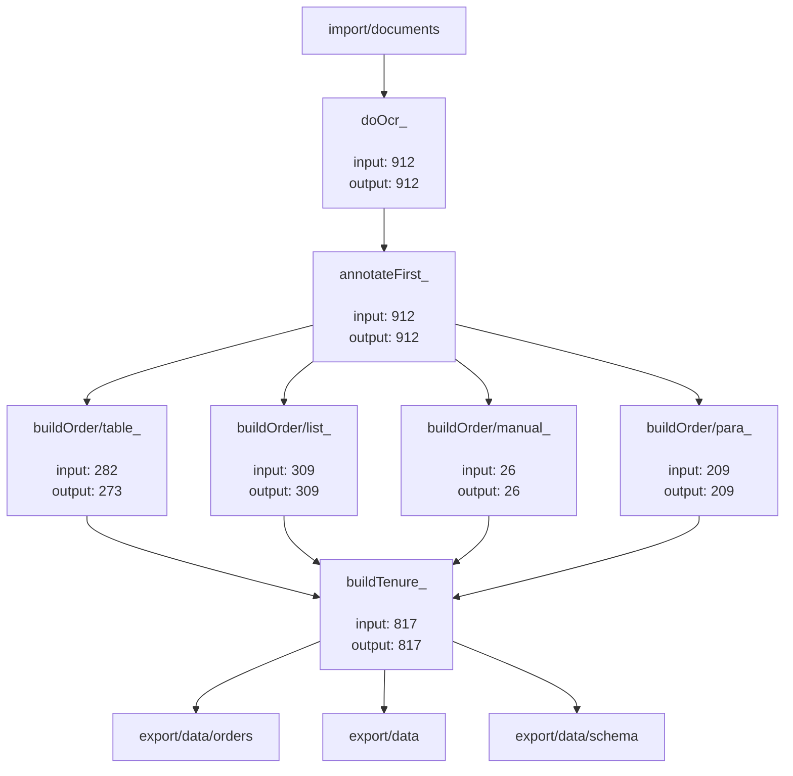

# Document Flow Diagram
This diagram is an auto-generated from directory structure of `flow` directory and links present in `input` and `output` sub-folders (tasks). Click the box (task) to explore more.

## Unprocessed Documents: 94
### Ignored Documents:
  - [ignore/duplicates_](ignore/duplicates_): 11
  - [ignore/swearingin_](ignore/swearingin_): 63
  - [ignore/notRelevant_](ignore/notRelevant_): 7
  - [ignore/correction_](ignore/correction_): 4
### Skipped Documents:
  - [buildOrder/table_](buildOrder/table_): 9
## Summary:
- Import Documents: 912
- Import Pages: 2,435
-  
- Export Documents: 817
- Export Pages: 2,175
-  
- Errors: 1,254
- Edits: 3,910
-  
- Edits per Page: **1.7977**
