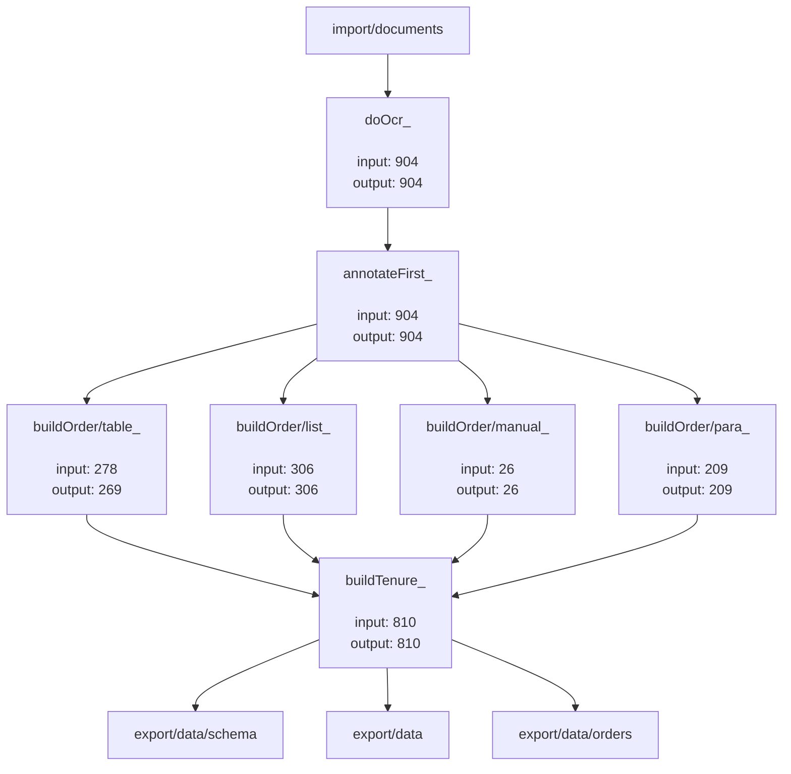

# Document Flow Diagram
This diagram is an auto-generated from directory structure of `flow` directory and links present in `input` and `output` sub-folders (tasks). Click the box (task) to explore more.

```mermaid
graph TD;
	buildOrder/table_[<div align=leg>buildOrder/table_</div><br/>input: 278<br/>output: 269] --> buildTenure_[<div align=leg>buildTenure_</div><br/>input: 810<br/>output: 810];
	buildOrder/list_[<div align=leg>buildOrder/list_</div><br/>input: 306<br/>output: 306] --> buildTenure_[<div align=leg>buildTenure_</div><br/>input: 810<br/>output: 810];
	buildOrder/manual_[<div align=leg>buildOrder/manual_</div><br/>input: 26<br/>output: 26] --> buildTenure_[<div align=leg>buildTenure_</div><br/>input: 810<br/>output: 810];
	buildOrder/para_[<div align=leg>buildOrder/para_</div><br/>input: 209<br/>output: 209] --> buildTenure_[<div align=leg>buildTenure_</div><br/>input: 810<br/>output: 810];
	annotateFirst_[<div align=leg>annotateFirst_</div><br/>input: 904<br/>output: 904] --> buildOrder/table_;
	annotateFirst_[<div align=leg>annotateFirst_</div><br/>input: 904<br/>output: 904] --> buildOrder/list_;
	annotateFirst_[<div align=leg>annotateFirst_</div><br/>input: 904<br/>output: 904] --> buildOrder/manual_;
	annotateFirst_[<div align=leg>annotateFirst_</div><br/>input: 904<br/>output: 904] --> buildOrder/para_;
	doOcr_[<div align=leg>doOcr_</div><br/>input: 904<br/>output: 904] --> annotateFirst_;
	import/documents --> doOcr_;
	buildTenure_ --> export/data/schema;
	buildTenure_ --> export/data;
	buildTenure_ --> export/data/orders;
	click buildOrder/list_ "https://github.com/orgpedia/cabsec/tree/main/flow/buildOrder/list_" "buildOrder/list_";
	click buildOrder/para_ "https://github.com/orgpedia/cabsec/tree/main/flow/buildOrder/para_" "buildOrder/para_";
	click doOcr_ "https://github.com/orgpedia/cabsec/tree/main/flow/doOcr_" "doOcr_";
	click buildTenure_ "https://github.com/orgpedia/cabsec/tree/main/flow/buildTenure_" "buildTenure_";
	click annotateFirst_ "https://github.com/orgpedia/cabsec/tree/main/flow/annotateFirst_" "annotateFirst_";
	click buildOrder/table_ "https://github.com/orgpedia/cabsec/tree/main/flow/buildOrder/table_" "buildOrder/table_";
	click buildOrder/manual_ "https://github.com/orgpedia/cabsec/tree/main/flow/buildOrder/manual_" "buildOrder/manual_";
	click export/data/orders "https://github.com/orgpedia/cabsec/tree/main/export/data/orders" "export/data/orders";
	click export/data "https://github.com/orgpedia/cabsec/tree/main/export/data" "export/data";
	click export/data/schema "https://github.com/orgpedia/cabsec/tree/main/export/data/schema" "export/data/schema";
	click import/documents "https://github.com/orgpedia/cabsec/tree/main/import/documents" "import/documents";
```
## Unprocessed Documents: 94
### Ignored Documents:
  - [ignore/duplicates_](ignore/duplicates_): 11
  - [ignore/swearingin_](ignore/swearingin_): 63
  - [ignore/notRelevant_](ignore/notRelevant_): 7
  - [ignore/correction_](ignore/correction_): 4
### Skipped Documents:
  - [buildOrder/table_](buildOrder/table_): 9
## Summary:
- Import Documents: 904
- Import Pages: 2,399
-  
- Export Documents: 817
- Export Pages: 2,145
-  
- Errors: 1,137
- Edits: 3,885
-  
- Edits per Page: 1.8112
